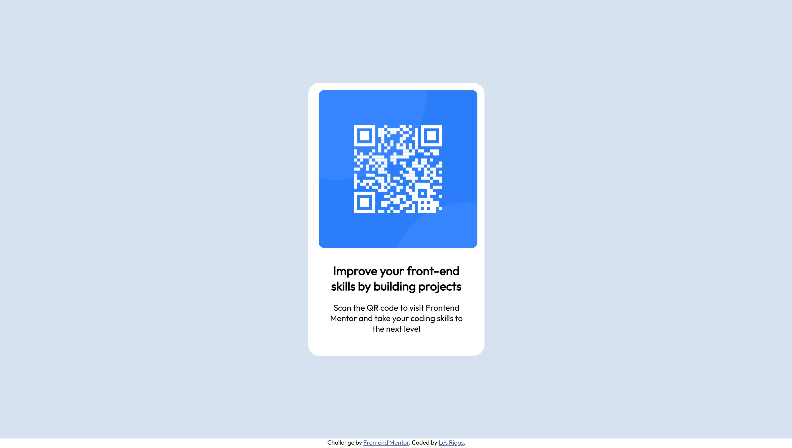

# Frontend Mentor - QR code component solution

This is a solution to the [QR code component challenge on Frontend Mentor](https://www.frontendmentor.io/challenges/qr-code-component-iux_sIO_H). Frontend Mentor challenges help you improve your coding skills by building realistic projects.

## Table of contents

- [Overview](#overview)
  - [Screenshot](#screenshot)
  - [Links](#links)
- [My process](#my-process)
  - [Built with](#built-with)
  - [What I learned](#what-i-learned)
  - [Continued development](#continued-development)
  - [Useful resources](#useful-resources)
- [Author](#author)

## Overview

### Screenshot

### Links

- Solution URL: [Add solution URL here](https://your-solution-url.com)
- Live Site URL: [Add live site URL here](https://your-live-site-url.com)

## My process

Began by just looking at the image of the page to be created looking for distinct areas and to see where there may be differences in styling. Then set out just the HTML then added the CSS adding the styling a bit at a time.
Style was created the main container and the white box to containe the qr-code and text. Centered the main container and positioned the white code box.
Next linked to the specified font and set required font and size prior to adding the final more detailed styling.

### Built with

- HTML5 and CSS

### What I learned

Used this as a starter just to test the bit of HTML 5 and CSS I have learned.

### Continued development

Going to move on to Flexbox and CSS Grid.

## Author

- Frontend Mentor - [@yLeslie763](https://www.frontendmentor.io/profile/Leslie763)
- Twitter - [@Leslie_763](https://www.twitter.com/@Leslie_763)

**Note: Delete this note and add/remove/edit lines above based on what links you'd like to share.**
